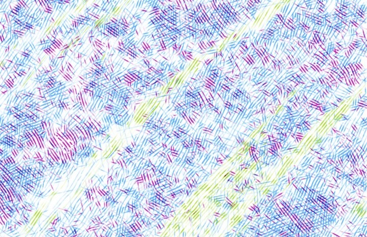
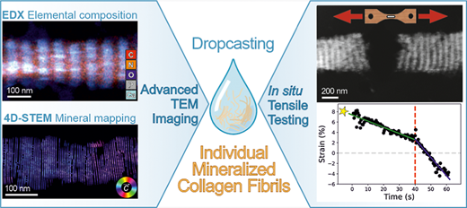
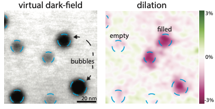
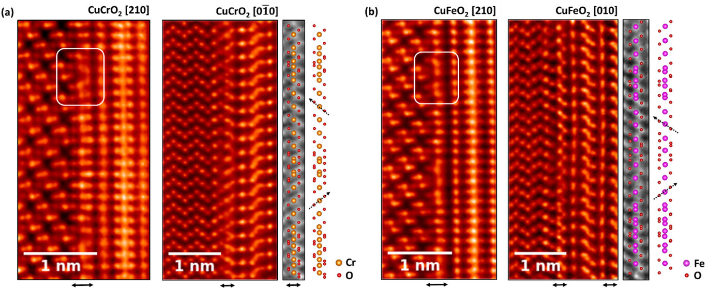
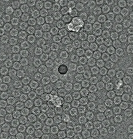

::::{div}
:class: nbc-resource-row nbc-user-program-row

:::{div}
:class: nbc-resource-image

```{image} assets/user_highlights/molecular-foundry.jpg
:alt: Molecular Foundry building at Lawrence Berkeley National Laboratory
:class: nbc-mf-photo
```

```{image} assets/user_highlights/MF-Logo.png
:alt: Molecular Foundry logo
:class: nbc-mf-logo
```

```{image} assets/user_highlights/Berkeley_lab.png
:alt: Lawrence Berkeley National Laboratory logo
:class: nbc-lbl-logo
```

:::

:::{div}
:class: nbc-resource-copy

**Interested in working with us?** The [Molecular Foundry](https://foundry.lbl.gov/) is a Department of Energy user facility that provides researchers with access to advanced instrumentation and scientific expertise. Through its [User Program](https://foundry.lbl.gov/user-program/user-program-overview/), access is free for non-proprietary research and awarded through a competitive, peer-reviewed proposal process. The standard call for proposals is in September and March.

Feel free to reach out to [Stephanie Ribet](./team.md) to learn more about user opportunities at the National Center for Electron Microscopy within the Molecular Foundry. Potential projects may include access to advanced electron microscopes, collaboration on data analysis, and requests for our custom condenser apertures.

:::

::::

## User Highlights

:::::{div}
:class: nbc-user-highlights-grid

::::{div}
:class: nbc-user-highlight-card

:::{dropdown} 
:class: nbc-user-highlight-toggle

4D-STEM characterization reveals how dynamic covalent crosslinking organizes otherwise immiscible polyolefin blends into mechanically robust, co-continuous architectures, helping to explain the enhanced mechanical properties of these material systems.

:::

E. K. Neidhart et al., “[Polyolefin blends with co-continuous architectures enabled by dynamic covalent crosslinking](https://doi.org/10.1126/sciadv.aee2328),” *Science Advances* **12**(20) (2026).

::::

::::{div}
:class: nbc-user-highlight-card

:::{dropdown} 
:class: nbc-user-highlight-toggle

Combining EDS, 4D-STEM, and in situ TEM tensile testing reveals the nanoscale composition, crystallographic organization, and mechanical response of individual mineralized collagen fibrils extracted from turkey leg tendon, connecting bone’s hierarchical ultrastructure to its strength and toughness.

:::

T. Kochetkova et al., “[Structural and Mechanical Analysis of Individual Mineralized Collagen Fibrils Using In Situ Transmission Electron Microscopy](https://doi.org/10.1021/acsnano.6c00964),” *ACS Nano* **20**, 10127–10137 (2026).

::::

::::{div}
:class: nbc-user-highlight-card

:::{dropdown} 
:class: nbc-user-highlight-toggle

In irradiated amorphous materials, structural heterogeneities can strongly influence bulk functional properties; 4D-STEM strain mapping of ion-irradiated amorphous Bi₂O₃ reveals up to 3% compressive strain and paracrystalline ordering around Ar bubbles, enabling estimates of bubble pressure.

:::

E. Kennedy\* and S. M. Ribet\* et al., “[Mapping strain and structural heterogeneities around bubbles in amorphous ionically conductive Bi₂O₃](https://doi.org/10.1016/j.matdes.2025.114282),” *Materials & Design* **256**, 114282 (2025).

::::

::::{div}
:class: nbc-user-highlight-card

:::{dropdown} 
:class: nbc-user-highlight-toggle

In this study, advanced scanning transmission electron microscopy (STEM) is employed to investigate the nucleation mechanisms governing the stable growth of Cu-based delafossites on Al₂O₃, specifically CuCrO₂ and CuFeO₂ thin films synthesized via molecular-beam epitaxy.

:::

A. Scheid et al., “[Atomic-Scale Mechanisms of Nucleation and Stabilization in CuCrO₂ and CuFeO₂ Delafossite Thin Films on Al₂O₃](https://doi.org/10.1002/admi.202500218),” *Advanced Materials Interfaces* **12**(12), 2500218 (2025).

::::

::::{div}
:class: nbc-user-highlight-card

:::{dropdown} 
:class: nbc-user-highlight-toggle

Extending STEM ptychography methods to biological structures, low-dose cryogenic electron ptychography was integrated into a single-particle analysis workflow to resolve proteins at sub-nanometer resolution.

:::

B. Küçükoğlu et al., “[Low-dose cryo-electron ptychography of proteins at sub-nanometer resolution](https://doi.org/10.1038/s41467-024-52403-5),” *Nature Communications* **15**, 8062 (2024).

::::

:::::
